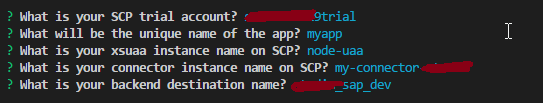

# App

## Create the app

The first step is to create our basic app. Below my-app is created but you can give it any name.
```
$ vue create my-app
```
* Manually select features and add Router (select with spacebar)
* Select ESLint + Standard Config
* Select Lint on Save
* Select in dedicated config files
* Save this as a preset? No

## Add SAP Cloud Foundry plugin

```
$ vue add scp-cf-app
```
A number of questions will be asked. 

* What is your SCP trial account ? 
Type your account name
* What is the unique name of your app?
Just give it the name you want
* What is your xsuaa instance name on SCP?
This is the uaa instance you made in the prerequisite
* What is your connector instance name on SCP?
This is the connectivity instance you made in the prerequisite
* What is your backend destination name?
This is the destination configuration name you made in the prerequisite

## Deploy

If you have not logged in to your cloud foundry SCP environment, run:
```
$ cf api https://api.cf.eu10.hana.ondemand.com
$ cf login
```

Once you have logged in, deploy by running:
```
$ npm run build && cf push
```


