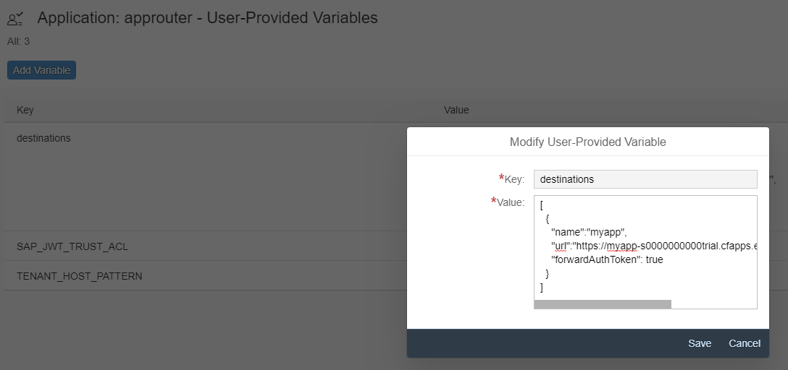

# Approuter

The application router is the single entry point for the (business) application. It has the responsibility to serve static content, authenticate users, rewrite URLs, and proxy requests to other micro services while propagating user information.


## Create the approuter

The first step is to create our basic approuter. Below my-approuter is created but you can give it any name.
```
$ vue create my-approuter --default
```

## Add SAP Cloud Foundry plugin

```
$ vue add scp-cf-approuter
```

## Adjust router configuration

The xs-app.json descriptor contains all configuration information used by the application router. A route defines how an incoming request path is updated and/or forwarded to a destination.<br>
<br>
One example is already given in xs-app.json<br>
``` json
{
  "routes": [
     {
        "source": "^/myapp/(.*)$",
        "target": "$1",
        "destination": "myapp"       
      }
  ]
}
```

## Adjust destination configuration

Make a mapping between the destination name and the actual url for the app in manifest.yml. If you have not made an app yet, deploy and alter this file later.
``` json
    destinations: >
      [
        {
          "name":"myapp",                                             
          "url":"https://myapp-s0000000000trial.cfapps.eu10.hana.ondemand.com/",    
          "forwardAuthToken": true                                    
        }
      ]
```
you can also change the destination config in SCP. Go to the user provided variables in the approuter app.




## Deploy
Run:
```
$ npm run build && cf push
```
