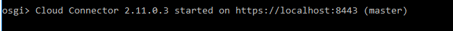

# Cloud Connector
The Cloud Connector is a small server installed inside the customer’s landscape and acts as a reverse proxy to establish a connection with the connectivity service on SAP Cloud Platform. Once the connection is established, the Cloud Connector accepts calls from SAP Cloud Platform and routes them through to the correct endpoint of one of the on-premise systems.

## Installation 
If you want to test the Cloud Connector you can install it on your laptop. 
* Go to <https://tools.hana.ondemand.com/#cloud> and install the Cloud Connector (CC) windows or windows (portable). 
* Go to your folder where you installed the CC and start go.bat. Your CC is now running on https://localhost:8443 
   
Some considerations: 
* Start the initial setup. Initial credentials > **user:** `Administrator` and **password:** `manage`. 
* The installation type is `Master`
* Your region starts with cf. For EU it is cf.eu10.hana.ondemand.com. 
* Your subaccount is the subaccount ID (see your SCP: subaccount details, field ID)

## Configuration
Go to `Cloud To On-Premise` and create a virtual host which maps to your SAP backend system. Click on the + button 

## UI Certificate
By default, the Cloud Connector includes a self-signed UI certificate. It is used to encrypt the communication between the browser-based user interface and the Cloud Connector itself. For security reasons, however, you should replace this certificate with your own one to let the browser accept the certificate without security warnings. 
Having the UI certificate properly configured will remove the warning (Untrusted Connection warning thrown in most browsers) we would get when accessing the Cloud Connector. 

The steps are well described in this [blog](https://blogs.sap.com/2017/06/26/how-to-guide-xca-quick-start-guide/). The basics are: 

* Open the Cloud Connector
* Go to Connector > Configuration, tab USER INTERFACE
* Press button `Generate certificate signing request` 
 
* Go to XCA and create a root certificate
* Import the downloaded CSR into XCA 
* Use the root certificate for signing the CSR 
* Download the signed CSR (now called a certificate!) in DER format
* Upload to the Cloud Connector  

For Chrome the SAN attribute should be the same as the CN attribute with a prefix of `DNS:`. 
The end result should be: 

## System certificate
In order to set up a mutual authentication between the Cloud Connector and any back-end system it connects to, you can import an X.509 client certificate into the Cloud Connector. The Cloud Connector will then use the so-called "system certificate" for all HTTPS requests to back-ends that request or require a client certificate. 

Copy from UI certificate 

## CA Certificate 
In order to use principal propagation you need to allow the Cloud Connector to propagate the user. In the case of HTTPS, the Cloud Connector will forward the true identity in a short-living X.509 certificate in an HTTP header named `SSL_CLIENT_CERT`. The backend system needs to use this certificate for logging on the real user.

Go to Configuration, Tab OnPremise, section CA Certificate + Click on icon to create a self-signed (typical self-signed for CA)

## Principal Propagation
Under Principal Propagation generate a sample certificate (the first icon in the row).  One of the roles of the SCC in the context of Principal propagation is to generate short-lived certificates based on some identity information retrieved from the logged in user.

We will use the generated sample certificate later in our configuration to build our rule in the CERTRULE transaction.
Enter your SCP login (emailaddress!) as CN name

### Refresh IdP
Go to `Cloud To On-Premise`, tab Principal Propagation and click on Refresh. The cloud connector is delivered without trusting any IdP by default.

## More info 
* [SAP help documentation](https://help.sap.com/viewer/cca91383641e40ffbe03bdc78f00f681/Cloud/en-US/db9170a7d97610148537d5a84bf79ba2.html)
* <https://blogs.sap.com/2015/07/13/cloud-connector-a-brief-guide-for-beginners/>

