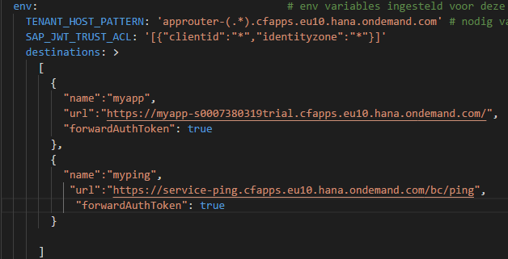
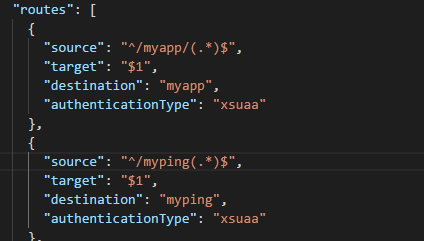
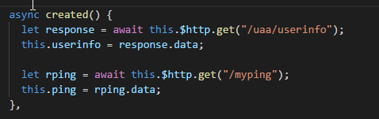

# Introduction

## Create microservice 
Microservices are created as spring boot applications in Spring Tool Suite. Download and install this from [https://spring.io/tools/sts](https://spring.io/tools/sts) 
 
## Consume microservice in app

* Change manifest.yml environment variable `destinations` (or in SCP directly) and add the destination to the url of the microservice 

* Change xs-app.json in your app and make a route to the destination 

* Call the service with axios ($http) in your app 

