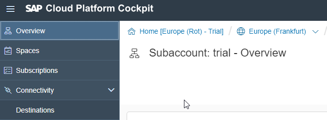
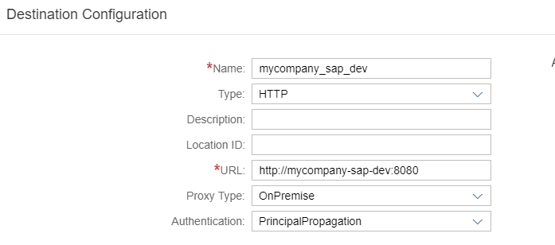
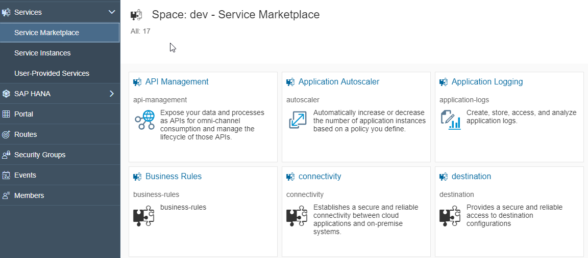
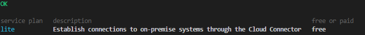

# SCP settings 

## Create a trial account 
Go to <https://cloudplatform.sap.com/index.html> and click on Free Trial to get an account on the SAP Cloud Platform.

## Create destination configuration
A destination is nothing more than a name for the virtual host you created in the SAP Cloud Connector. In the app we will retrieve the virtual host from the destination name. For this there is an npm package [scp-cf-destination](/packages/npm.html) which our vue app plugin will make use of<br><br>
Go to your subaccount<br>

<br><br>
Click on:<br>

<br><br>
Create a new destination. change `mycompany_sap_dev` to any name which is convenient for your company. In the URL field type the name of the **virtual host** your created in the Cloud Connector<br>



## Create destination Service Instance 
Provides a secure and reliable access to the destination configuration<br>
From the service marketplace, click on `Destination`  :<br>
 

Create a new instance. Basically it is just a name (e.g `my-destination`) but later on we will bind this instance to our app so that env variable VCAP_SERVICES has the destination service API url with which we can retrieve the virtual host. So it is essential for connecting our onpremise SAP backend to your app.

## Create uaa service instance 
Configure trust to identity providers for authentication. Manage your authorization model consisting of roles, groups and role collections, and assigning them to users. Use RESTful APIs to automate and integrate with other systems.
From the service marketplace, click on `Authorization & Trust Management` and create a new instance.

## Create connectivity service instance 
Establishes a secure and reliable connectivity between cloud applications and on-premise systems.

### Create with SCP gui
Go to your space within your subaccount and then go to the Service markeplace. From the service marketplace, click on `Connectivity` and create a new instance.
<br>

### Create with CF CLI
You can also create this service instance (for instance `my-connector`) with the CF CLI<br>
First check which plan there is available with:
``` js
$ cf marketplace -s connectivity
```
<br>
And then create the service instance with the plan available
``` js
$ cf create-service connectivity lite my-connector
```

